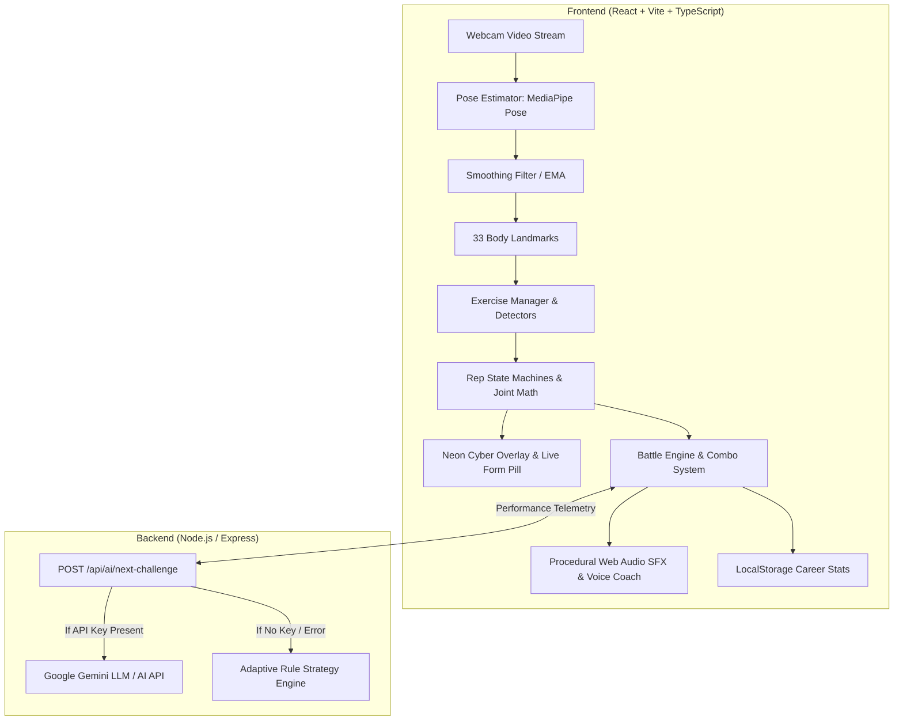

# ⚡ AI FITNESS BATTLE

> **A Full-Stack Motion Combat Game Connecting Real-World Physical Movement with Adaptive AI**  
> *Built for Hackathons & Next-Generation Interactive Fitness Gaming*

---

## 🏆 Project Overview

**AI Fitness Battle** is a fully playable web game where players physically execute real-world exercises in front of their webcam to fight against an escalation of AI monsters and bosses. 

Instead of tapping buttons or looking at static dashboards, the player's physical body movement is captured in real time through an in-browser **33-landmark pose estimation model**. Anatomical joint angles (knee flexion, hip depth, elbow compression, arm sweep) drive precision state machines that count valid repetitions, detect cheated/shallow form, build combo streaks, and unleash kinetic attacks against enemy monsters.

After each challenge, an **Adaptive AI Game Master** evaluates the player's performance score, movement quality, speed cadence, and fatigue curves to dynamically adjust the next challenge's difficulty and exercise selection.

---

## 🎮 Core Game Concept

1. **Mission Briefing**: The player faces 5 escalating cybernetic monsters:
   - **Training Goblin** (Level 1 Sparring Partner)
   - **Cyber Beast** (Level 2 Overclocked Neon Wolf)
   - **Iron Titan** (Level 3 Heavy Armored Mech)
   - **Shadow Wraith** (Level 4 Agile Shinobi)
   - **NEXUS PRIME** (Level 5 The Omniscient AI Singularity Final Boss)
2. **Camera Calibration**: Before entering the arena, the player steps back until the computer vision system locks onto their full skeleton (head, shoulders, hips, knees, and feet).
3. **Motion Combat Loop**:
   - The AI issues a target: e.g. `DO 8 SQUATS IN 45s`.
   - The player physically performs squats in front of the camera.
   - The computer vision engine tracks the hip-knee-ankle joint angle. When thighs reach parallel depth ($\le 100^\circ$), and return upright ($\ge 160^\circ$), a repetition is verified.
   - Shallow or cheated movements trigger instant live coaching: *"GO LOWER! HIT PARALLEL DEPTH"*.
   - Consecutive valid reps build **Combo Multipliers** ($3\times \rightarrow 1.25\times$, $5\times \rightarrow 1.5\times$, $10\times \rightarrow 2.0\times$).
4. **Kinetic Attack Release**: Once required repetitions are met, the player triggers an animated attack that damages the monster.
5. **Monster Retaliation**: If the challenge timer expires before target reps are completed, the monster counter-attacks the player's integrity.
6. **Adaptive AI Scaling**: The AI computes a normalized Performance Score (accuracy, speed, quality, consistency) and dynamically decides the next exercise and difficulty tier.
7. **Victory / Defeat Screen**: Detailed breakdown of reps per exercise, accuracy %, active workout duration, and personalized AI debriefing narrative persisted to local storage.

---

## 🧠 Real AI Implementation (Two-Tier Architecture)

AI is not a cosmetic label—it is integrated deeply across two distinct layers:

### Level 1: Computer Vision AI (Browser-Based Edge Inference)
- Powered by **MediaPipe Pose** with 33 full-body 3D landmarks.
- An exponential moving average (EMA) low-pass filter ($\alpha = 0.68$) eliminates camera noise and jitter.
- Normalizes distances relative to torso length (mid-shoulder to mid-hip distance) so detection is invariant to player height or distance from the camera.
- State machines with strict hysteresis prevent double counting:
  - **Power Squats**: Tracks bilateral knee angles and spine tilt (shoulder-hip inclination).
  - **Cyber Jumping Jacks**: Coordinates arm elevation (wrist over shoulder, $\ge 135^\circ$ angle) with ankle spread ratio ($\ge 1.6\times$ shoulder width).
  - **Hyper Lunges**: Analyzes working lead knee flexion ($\le 105^\circ$) and return to neutral standing.
  - **Velocity High Knees**: Torso-normalized alternating knee lift reaching hip elevation threshold.
  - **Titan Push-ups**: Plank spine alignment and elbow flexion ($\le 95^\circ$).

### Level 2: Adaptive AI Game Master & Personal Coach
The AI does not follow hardcoded script rounds. Instead, it operates on real biomechanical performance data:

$$\text{Performance Score} = 0.40 \cdot \text{Accuracy} + 0.20 \cdot \text{Completion Rate} + 0.15 \cdot \text{Movement Quality} + 0.15 \cdot \text{Speed Cadence} + 0.10 \cdot \text{Consistency}$$

- **Score $\ge 85$**: AI escalates difficulty tier, increases rep targets, and tightens time constraints.
- **Score $65 - 84$**: AI maintains current difficulty for optimal cardiovascular pacing.
- **Score $< 65$**: AI lowers resistance, shifts to achievable cardio recovery exercises, and offers form tips.

#### Dual Strategy Architecture:
1. **LLM Strategy (`POST /api/ai/next-challenge`)**: If an `AI_API_KEY` (e.g. Google Gemini) is supplied in `.env`, the backend queries the LLM with full context (player HP, monster HP, fatigue index, previous exercises, accuracy) and returns structured JSON with reasoning and tailored voice lines.
2. **Adaptive Rule Strategy (Offline Fallback)**: If offline or no API key is provided, the exact same interface is fulfilled by a deterministic mathematical decision engine. **The game remains 100% playable in any environment without external keys.**

---

## 🏗️ System Architecture



---

## 🛠️ Technology Stack

- **Frontend Core**: React 19, TypeScript, Vite 6
- **Computer Vision**: `@mediapipe/pose`, `@mediapipe/camera_utils`, Canvas 2D Overlay
- **Backend**: Express.js, TypeScript, Node.js (`tsx`)
- **Audio & Speech**: Web Audio API (procedural synthesis, no external assets), Web Speech Synthesis API
- **Styling**: Cyberpunk design system, Neon Glow tokens, glassmorphism, responsive grid layout
- **Visual Effects**: Custom animated SVG avatars, screen shake keyframes, `canvas-confetti`

---

## 🚀 Getting Started

### 1. Prerequisites
- Node.js version 18+ (tested on Node v22 and v24)
- Webcam connected to your computer (or use the built-in **Simulation Mode**)

### 2. Installation
Clone the repository and install dependencies:
```bash
git clone <repo-url>
cd "Antigravity Fitness"
npm install
```

### 3. Environment Variables (Optional)
Create a `.env` file in the root directory (or copy from `.env.example`):
```bash
cp .env.example .env
```
Inside `.env`:
```env
# Optional: Provide Google Gemini API Key for dynamic LLM battle master commentary
# If left empty, the game automatically uses the built-in deterministic Adaptive Rule Strategy!
AI_API_KEY=
PORT=3001
```

### 4. Running the Game
Start both client and server with a single command:
```bash
npm run dev
```
- **Web App**: `http://localhost:5173`
- **Backend API**: `http://localhost:3001`

*(Alternatively, run client only with `npm run dev:client` or server with `npm run dev:server`)*

---

## 🧪 How to Test & Demo (Hackathon 3-Minute Run)

1. Open `http://localhost:5173`.
2. Click **START BATTLE**.
3. **Calibration**: Step back until your face, shoulders, hips, knees, and feet are outlined in green. The 3-second countdown will lock on.
4. **Round 1 (Training Goblin)**: Perform squats! Watch the rep counter increment automatically when you sink down and stand back up.
5. **Attack!**: Complete the target reps to unleash an energy blast on the Goblin.
6. **AI Adaptation**: Observe the AI coach analyze your rep duration and accuracy to assign Round 2 (e.g. Cyber Jacks or Hyper Lunges).
7. **NEXUS PRIME Boss Battle**: Defeat the monsters to challenge the final AI core and view your victory debrief!

### ⚡ Simulation / Dev Mode
For testing in environments where a webcam is unavailable or permissions are restricted:
- Click the **⚡ DEMO MODE** toggle in the top navbar.
- The game will provide `+ SIMULATE GOOD REP` and `✕ SIMULATE SHALLOW REP` buttons to test all battle mechanics, audio SFX, AI adaptations, and victory screens instantly!

---

## 📊 Exercise Technical Standards

| Exercise | Primary Joint Angle | Valid Depth Threshold | Return Threshold | Form Checks |
| :--- | :--- | :--- | :--- | :--- |
| **Power Squats** | Hip - Knee - Ankle | $\le 102^\circ$ (Parallel) | $\ge 160^\circ$ (Standing) | Spine inclination $\le 38^\circ$ |
| **Cyber Jacks** | Hip - Shoulder - Wrist | Arms $\ge 135^\circ$, Wrists above Head | Arms $\le 45^\circ$, Feet close | Ankle spread $\ge 1.6\times$ shoulder width |
| **Hyper Lunges** | Lead Hip - Knee - Ankle | $\le 105^\circ$ (90° lunge bend) | $\ge 155^\circ$ (Both standing) | Trailing knee drop, posture |
| **Velocity High Knees** | Hip to Knee Vertical Elevation | Knee within $15\%$ torso length of hip | Knee drops below neutral | Alternating left & right cycle |
| **Titan Push-ups** | Shoulder - Elbow - Wrist | $\le 95^\circ$ (Chest to floor) | $\ge 150^\circ$ (Plank lock) | Straight plank body line |

---

## 🔒 Security & Safety

- No API keys are bundled into frontend client code.
- Backend calls to AI models are validated and clamped:
  - Repetitions clamped between $5$ and $25$.
  - Time limits clamped between $20\text{s}$ and $80\text{s}$.
  - Difficulty tiers clamped between $1$ and $5$.
- Deterministic fallback ensures the server never crashes if the external AI API is rate-limited or unavailable.

---

## 🔮 Future Enhancements
- Multiplayer WebRTC 1v1 fitness battles.
- Wearable heart rate monitor (BLE / Web Bluetooth API) integration.
- Custom user workout routines and HIIT challenge modes.
# Ai-Fitness

